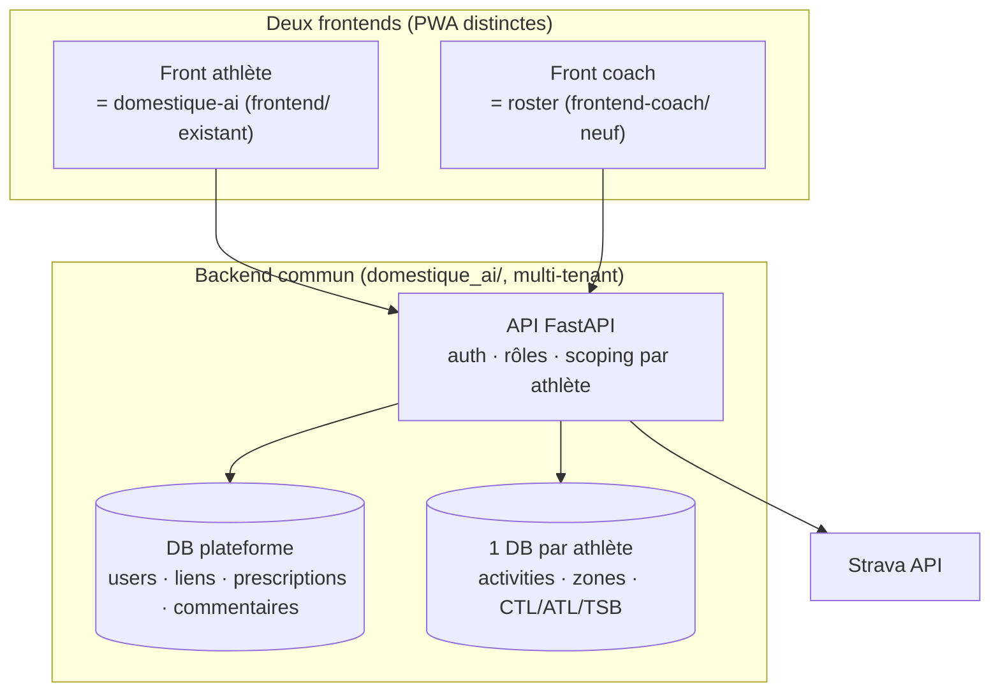
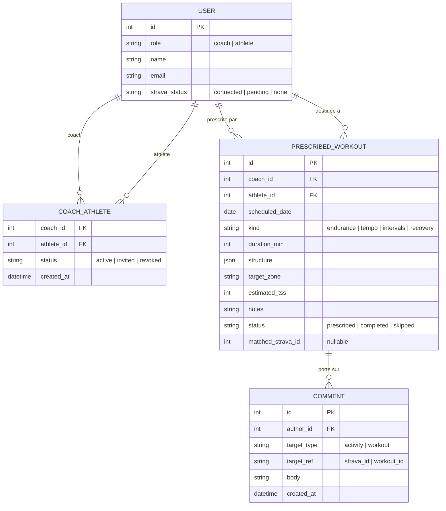
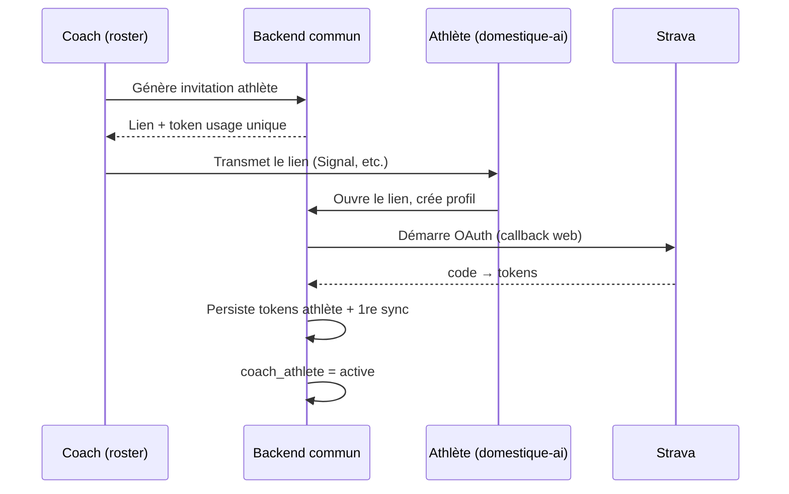

# Architecture — application Coach / Athlète (roster)

Document de conception pour **roster**, le **frontend coach** d'une plateforme de
suivi coach (humain) ↔ athlète, construite en faisant évoluer
[domestique-ai](./README.md) vers un **backend commun multi-tenant** servant
**deux frontends**.

> **Statut** : document de conception. Aucun code n'a encore été écrit.
> Nom du front coach : **`roster`** — le coach gère son *roster* d'athlètes.

---

## 1. Contexte et besoin

domestique-ai est un coach IA **mono-utilisateur** : un athlète, sa base SQLite,
ses tokens Strava, son profil. Le déploiement multi-utilisateur existant
(`MULTI_USER_DEPLOY.md`) fonctionne par **isolation totale** — un conteneur par
personne, sans aucune visibilité croisée (« c'est voulu »).

Le besoin exprimé casse précisément cette isolation : un **coach humain** suit
plusieurs athlètes de son entourage, leur donne des séances, et veut voir quand
une séance est réalisée **avec toutes les données de l'activité** (TSS, zones HR,
CTL/ATL/TSB, carte) — exactement le niveau de détail que domestique-ai produit
déjà pour un seul utilisateur.

### Périmètre retenu

| Dimension | Choix | Conséquence |
| --- | --- | --- |
| Ambition | **Cercle fermé** : un coach + une poignée d'athlètes (≤ ~10) qu'il connaît | Pas de marketplace, pas d'inscription publique, pas de facturation |
| Rôle du coach | Voir les activités réalisées · **prescrire** des séances · comparer **prévu vs réalisé** · **commenter** | Modèle de données relationnel partagé coach↔athlète obligatoire |
| Source de données athlète | **Chacun son Strava** (OAuth self-service) | Réutilise tout le pipeline d'ingestion existant |
| Push Garmin par le coach | **Hors périmètre** (décision actée) | L'athlète reçoit ses séances dans l'app + export iCal optionnel. Pas d'écriture vers Garmin Connect. |
| Expérience athlète | **C'est domestique-ai** (front existant), pas une vue rabougrie | L'athlète garde dashboard, coach LLM, plans, tendances |
| Structure | **Un backend commun + deux frontends, dans le repo domestique-ai actuel** | Pas de fork, pas de package partagé à maintenir, un seul déploiement |

---

## 2. Le choix structurant : un backend, deux frontends

L'insight clé : **l'athlète n'a pas besoin d'une nouvelle app, il a déjà
domestique-ai.** Il suffit que le coach ait *son* frontend (roster) branché sur
le **même backend**.



### Trajectoires évaluées

| Option | Principe | Verdict |
| --- | --- | --- |
| **A — Overlay coach** | Garder un conteneur par athlète, dashboard coach qui lit les API de chaque athlète et agrège | **Rejetée.** La boucle prescrire → réaliser → commenter exige un modèle relationnel partagé. Cross-référencer des conteneurs isolés serait ingérable. |
| **B — Deux backends + package partagé** | Extraire un `domestique-core`, deux apps full-stack distinctes | **Rejetée.** Oblige à synchroniser deux backends et à reconstruire une « vue athlète ». Complexité inutile. |
| **C — Un backend commun, deux fronts** *(retenue)* | Le backend domestique-ai devient multi-tenant et sert le front athlète (existant) + un front coach (roster) | **Retenue.** Une seule source de vérité, l'athlète garde toute l'expérience domestique-ai, rien à synchroniser. |

### Pourquoi C gagne

- **L'athlète garde toute l'expérience domestique-ai** : dashboard, coach LLM,
  plans, tendances. On réutilise le front athlète **tel quel** au lieu de
  reconstruire une vue dégradée.
- **Une seule source de vérité.** Le coach lit les données de l'athlète
  directement dans le backend (avec autorisation) ; prescriptions et
  commentaires y vivent aussi. Pas de cross-référencement par API.
- **Pas de package partagé à maintenir.** On n'extrait un cœur commun que
  lorsqu'on a deux backends à alimenter. Ici il n'y en a qu'un : la logique
  métier reste simplement dans le backend.
- **Churn minimal.** Le repo domestique-ai existe déjà avec backend + frontend
  ensemble. On ajoute un second frontend, on rend le backend multi-tenant.

---

## 3. Le prérequis technique : config injectable

Aujourd'hui, **toute la config passe par `domestique_ai.config`** qui lit des
variables d'environnement globales (`STRAVA_HR_REST`, `STRAVA_FTP`, chemin DB
unique…). Parfait pour un seul athlète, bloquant pour plusieurs.

Le refactor central — et quasiment le seul du moteur — consiste à remplacer les
lectures globales par un **contexte explicite injecté** :

```python
@dataclass(frozen=True)
class AthleteContext:
    db_path: Path
    strava_tokens_path: Path
    hr_rest: int | None
    hr_max: int | None
    ftp: int | None
    lthr_pct: float
    sex: str | None
    objective_path: Path | None
    availability_path: Path | None
```

- Les fonctions du moteur (`compute_training_load`, `sync_activities`,
  `calculate_hr_zones`, …) reçoivent ce contexte au lieu d'appeler
  `config.get_*()`.
- **Rétrocompatibilité** : un contexte par défaut construit depuis l'env →
  le mode mono-utilisateur historique de domestique-ai continue de fonctionner
  à l'identique (utile pour ton instance perso et les déploiements existants).
- **Multi-tenant** : à chaque requête authentifiée, le backend construit
  l'`AthleteContext` de l'athlète concerné (db_path = `data/athletes/<id>.db`,
  profil HR/FTP lu depuis la DB plateforme, tokens dans un fichier dédié).

> C'est exactement ce que la règle « ne jamais lire `os.getenv` ailleurs que
> dans config » avait anticipé : un point d'entrée unique à rendre paramétrable,
> et tout le reste suit. Le refactor reste conséquent (beaucoup d'appelants) mais
> mécanique et testable — la suite de tests existante sert de filet.

---

## 4. Modèle de données

### 4.1 DB plateforme (centrale, neuve)

Porte tout le relationnel coach↔athlète. SQLite au départ (cohérent avec
l'existant) ; migrable vers Postgres si l'usage grossit.



Notes de conception :

- `matched_strava_id` relie une séance prescrite à l'activité Strava qui la
  réalise (voir §6.3). `NULL` tant que non réalisée.
- Un commentaire cible soit une **activité** (`strava_id`, vit dans la DB
  athlète), soit une **séance prescrite** (`workout_id`, DB plateforme). On ne
  duplique pas les activités dans la DB plateforme : on les référence.
- Pas de table `password` au départ — voir §5 (auth par lien d'invitation).

### 4.2 DB par athlète (réutilisée telle quelle)

Une base SQLite par athlète, **schéma identique à domestique-ai** (table
`activities` + colonnes zones HR, températures, etc.). Aucun changement de
schéma : c'est le moteur existant qui écrit dedans via l'`AthleteContext`.

| Avantage du choix « DB par athlète » | Détail |
| --- | --- |
| Réutilise le moteur **quasi sans le toucher** | Le moteur prend déjà un `db_path` ; pas besoin d'ajouter un `athlete_id` à chaque requête. |
| Isolation forte | Une fuite de requête ne peut pas exposer les données d'un autre athlète. |
| Sauvegarde/suppression triviale | Supprimer un athlète = supprimer son fichier + ses lignes plateforme. |
| Modèle déjà éprouvé en prod | `MULTI_USER_DEPLOY.md` tourne déjà ainsi. |

| Limite | Mitigation |
| --- | --- |
| Les requêtes coach « tous mes athlètes » font du fan-out multi-DB | Trivial pour ≤ 10 athlètes (boucle). Au-delà, envisager Postgres + `athlete_id`. |
| Pas de jointure SQL cross-athlète | Non nécessaire : le coach regarde un athlète à la fois. |

---

## 5. Authentification et onboarding

Périmètre fermé → pas de flow d'inscription publique. Modèle léger, **commun aux
deux frontends** (même backend, mêmes comptes, rôle qui décide du front servi) :

1. **Le coach** a un compte (premier utilisateur, créé au setup).
2. **Invitation** : le coach génère un lien d'invitation pour un athlète
   (token à usage unique, transmis hors bande — comme le token API actuel).
3. **L'athlète** ouvre le lien, crée son profil minimal (nom, profil HR/FTP),
   puis **connecte son Strava** via le flow OAuth (réutilisé de
   `strava_oauth_flow`, rendu self-service web au lieu d'interactif CLI). Il
   atterrit ensuite dans **le front domestique-ai**.
4. Le lien `coach_athlete` passe `invited → active` à la première connexion
   Strava réussie.



Réutilise la logique de session/token existante (login par token, stockage
`localStorage`, PWA installable). L'évolution : passer d'un token unique global à
**un compte par personne avec un rôle**, et router vers le bon front selon le
rôle.

> Sécurité : les tokens Strava de chaque athlète restent isolés (un fichier par
> athlète, jamais commité). Le coach ne voit **jamais** les tokens, seulement les
> données dérivées exposées par l'API.

---

## 6. La boucle de coaching

### 6.1 Prescription d'une séance

Le coach prescrit une séance à un athlète pour une date donnée, en s'appuyant sur
le générateur existant :

- Génération assistée via `plan_builder` / `plan_generator` (le coach demande
  « une séance de seuil de 1 h » et ajuste), **ou** saisie manuelle.
- La validation déterministe de `plan_validator` empêche une structure aberrante
  (20 min de Z5 d'affilée).
- Stockage dans `PRESCRIBED_WORKOUT` (statut `prescribed`).
- **Pas de push Garmin** (acté). L'athlète consulte la séance dans domestique-ai ;
  export iCal optionnel via `export/ics` pour l'ajouter à son agenda.

### 6.2 Côté athlète

L'athlète voit ses séances à venir **dans domestique-ai**, réalise sa sortie, et
son activité remonte par la **sync Strava** habituelle (auto-sync APScheduler ou
manuelle) dans **sa** base. Aucun geste spécifique.

### 6.3 Matching prévu vs réalisé

Quand une activité arrive, on tente de l'apparier à une séance prescrite :

- **Heuristique** : séance `prescribed` la plus proche en date (± 1 jour), même
  bucket de sport → on renseigne `matched_strava_id`, statut `completed`.
- **Filet** : athlète ou coach peut confirmer/corriger l'appariement à la main.
- Une séance sans activité appariée après sa date bascule en `skipped` (signal
  utile au coach).

Vue comparée : la séance prescrite (cible : durée, zone, TSS estimé) face à
l'activité réalisée (durée réelle, zones tenues, TSS calculé, dérive HR). Le
comparateur `similar.py` peut enrichir.

### 6.4 Messagerie / commentaires

Fil de commentaires léger attaché à une activité ou une séance, visible des deux
fronts. Coach et athlète peuvent écrire. Pas de temps réel au départ (polling
suffit). Notifications optionnelles via le module Pushover existant.

---

## 7. Rôle du LLM

⚠️ **Collision de vocabulaire** : dans domestique-ai, « coach » = le LLM. Ici,
« coach » = un humain (qui utilise roster). Le LLM **n'est pas le coach** — il
reste un **assistant** :

- côté athlète (domestique-ai) : le coach LLM existant, scopé à **ses** données
  via l'`AthleteContext`.
- côté coach humain (roster) : peut résumer l'exécution d'un athlète, signaler
  une dérive (« Bob a coupé court 3 séances de suite »), proposer une séance.

Le LLM reste **optionnel pour le MVP**. La boucle humaine (prescrire → voir →
comparer → commenter) a la priorité.

---

## 8. Découpage technique

### Backend commun (`domestique_ai/`, repo existant)

On étend l'API existante (un routeur par domaine) avec les domaines neufs :

```text
domestique_ai/
├── config.py          # → AthleteContext injectable (prérequis §3)
├── ingestion/         # inchangé (Strava OAuth, sync, backfill)
├── processing/        # inchangé (charge, zones, trends, plan, similar)
├── export/            # inchangé (ics)
├── llm/               # inchangé (assistant, scopé par athlète)
└── api/
    ├── main.py        # sert les deux frontends + /api
    ├── (routeurs existants : metrics, activities, morning, strava, coach, plan…)
    ├── auth.py        # NEW — comptes, rôles, invitations, sessions
    ├── athletes.py    # NEW — onboarding Strava self-service, profils
    ├── roster.py      # NEW — vue coach : liste athlètes, agrégats
    ├── workouts.py    # NEW — prescription, matching prévu/réalisé
    └── comments.py    # NEW — fil de commentaires
```

### Deux frontends

```text
frontend/         # athlète — domestique-ai (existant, peu de changements)
frontend-coach/   # coach — roster (neuf), réutilise des composants de frontend/
```

| Écran | Front | Réutilise |
| --- | --- | --- |
| Dashboard perso, coach LLM, plans, tendances | athlète (`frontend/`) | existant |
| Mes séances prescrites + commentaires du coach | athlète (`frontend/`) | ajouts légers |
| Liste de mes athlètes | coach (`frontend-coach/`) | nouveau |
| Dashboard d'un athlète | coach (`frontend-coach/`) | composants dashboard domestique-ai |
| Détail activité | coach (`frontend-coach/`) | vue activité domestique-ai (graphes, carte) |
| Prescription de séance | coach (`frontend-coach/`) | builder de plan domestique-ai |
| Prévu vs réalisé | coach + athlète | nouveau (compose les deux) |

Le backend sert les deux PWA (chemins/ports distincts) et expose une `/api`
commune, scopée par rôle. Les composants partagés (graphes recharts, carte
react-leaflet, vue activité) peuvent être factorisés entre les deux fronts.

---

## 9. Roadmap par paliers

Ordre pensé pour mettre quelque chose entre les mains de l'ami **au plus tôt**.

| Palier | Contenu | Valide |
| --- | --- | --- |
| **0 — Config injectable** | Refactor `config` → `AthleteContext`, rétrocompatible. Tests verts. | Prérequis multi-tenant |
| **1 — Comptes & rôles** | DB plateforme (users, liens), auth par invitation, onboarding Strava self-service. domestique-ai marche encore en mode mono. | Socle multi-tenant |
| **2 — MVP lecture coach** | Front `roster` : le coach voit la liste de ses athlètes et le détail d'une activité réalisée. | **Besoin n°1 de l'ami** |
| **3 — Prescription** | Le coach crée/assigne une séance (sans push Garmin) ; l'athlète la voit dans domestique-ai. | Boucle descendante |
| **4 — Prévu vs réalisé** | Matching séance↔activité + vue comparée. | Cœur de la valeur coaching |
| **5 — Messagerie** | Commentaires sur activité/séance + notifs optionnelles. | Boucle relationnelle |
| **6 — Assistant LLM coach** | Résumés/alertes côté roster. | Confort, non bloquant |

Recommandation : livrer 0→2 d'abord, faire essayer à l'ami, puis décider de la
suite selon son retour réel.

---

## 10. Décisions actées vs ouvertes

**Actées :**

- Nom du front coach : **`roster`**.
- **Un backend commun multi-tenant + deux frontends**, dans le **repo
  domestique-ai actuel** (`frontend/` athlète + `frontend-coach/` roster).
- **Pas de push Garmin** par le coach.
- Cercle fermé, athlètes invités, **chacun son Strava**.
- L'athlète **utilise domestique-ai** (pas de vue dégradée).
- **DB par athlète** + DB plateforme centrale.
- LLM = **assistant**, pas le coach ; optionnel au MVP.

**À trancher plus tard :**

- SQLite vs Postgres pour la DB plateforme (SQLite suffit, Postgres si ouverture).
- Hébergement (même RPi que domestique-ai — probable).
- App Strava : réutiliser la même (quota partagé, cf. `MULTI_USER_DEPLOY.md`) vs
  app dédiée.
- Servir les deux fronts : chemins distincts derrière le même backend vs ports
  distincts vs sous-domaines Tailscale.
- Vue « charge agrégée » multi-athlètes pour le coach, ou un athlète à la fois ?

---

## 11. Risques et points d'attention

| Risque | Mitigation |
| --- | --- |
| Refactor config sous-estimé (beaucoup d'appelants) | S'appuyer sur la suite de tests existante ; faire le refactor isolément, en gardant le mode mono rétrocompatible. |
| Backend multi-tenant introduit des fuites de données entre athlètes | Isolation par DB + contrôle d'accès strict côté API (athlète = sa base ; coach = ses athlètes liés seulement). À tester explicitement. |
| Quota Strava partagé entre tous les athlètes | Rester sous 1000 req/jour ; espacer les backfills (cf. limites de `MULTI_USER_DEPLOY.md`). |
| Couplage des deux fronts à un seul backend | Acceptable et voulu (source de vérité unique). Versionner l'`/api` proprement pour éviter qu'un changement coach casse le front athlète. |
| Collision « coach » (LLM vs humain) | Nommer explicitement (`assistant` pour le LLM) dès le code. |
| Régression du mode mono domestique-ai | Le contexte par défaut depuis l'env doit rester un chemin testé en CI. |
