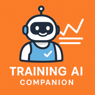

# DomestiqueAI 🚴‍♂️🤖

<p align="center">
  
</p>


[](https://github.com/astral-sh/ruff)


The smart assistant for cyclists. Automatic training load analysis,
fitness state, detailed view of each ride (GPS map, HR / elevation /
power charts, GPX export), **overtraining signal detection** (chronic
TSB, Monotony/Strain, HRV, resting HR) and a **conversational LLM
coach** that analyzes your rides on demand without making up a single
number.

## Architecture

```text
domestique_ai/
├── config.py                # data paths, FTP, HR profile, secrets via .env
├── ingestion/
│   ├── strava.py            # OAuth2 client + SQLite persistence (refresh, streams)
│   └── strava_oauth_flow.py # initial interactive auth flow
├── processing/
│   ├── analyzer.py          # TSS / hr-TSS, CTL/ATL/TSB, HR zones (Karvonen)
│   ├── gpx.py               # GPX 1.1 export from Strava streams
│   ├── overtraining.py      # 4 auto indicators (chronic TSB, Monotony/Strain, weekly jump)
│   └── morning_metrics.py   # CRUD HRV/resting HR/sleep/stress + baselines + alerts
├── llm/
│   ├── ollama_client.py     # Ollama SDK wrapper (async streaming + tool calling)
│   ├── tools.py             # tools exposed to the LLM (load, activities, overtraining, plan, …)
│   ├── coach.py             # coach agentic loop (system prompt + tool loop)
│   ├── objectives.py        # YAML objective handling (data/objective.yaml)
│   └── conversations.py     # chat session persistence (SQLite)
├── api/                     # FastAPI app, one router per domain
└── export/                  # FIT files + Garmin Connect push
```

Frontend lives in `frontend/` (React 18 + Vite + TypeScript + Tailwind + recharts).

Source of truth: local SQLite (`data/strava_activities.db`). A single
`activities` table with `strava_id` UNIQUE — idempotent ingestion.

## Training load computation

Two modes, automatically selected based on available data:

- **Power TSS** — via `STRAVA_FTP` and the activity's average power.
- **hr-TSS (normalized TRIMP)** — via average HR, `STRAVA_HR_REST` and
  `STRAVA_HR_MAX`. Banister exponential TRIMP, normalized so that 1 h
  spent at `STRAVA_LTHR_PCT` (88 % of HRR by default) is worth 100
  points: same scale as power TSS.

**Priority**: if HR + HRrest + HRmax are configured, hr-TSS takes
precedence over power — handy without a reliable FTP. Use the
« 🔁 Recalculate load » button in the dashboard to replay the score
across the whole history after a profile change.

### HR zones (%HRR Karvonen)

Each activity with an HR stream is split into 5 zones:
Z1 (<60 %) · Z2 (60-70 %) · Z3 (70-80 %) · Z4 (80-90 %) · Z5 (≥90 %).
Use the « 📥 Backfill HR zones » button in the sidebar to backfill
history (1 Strava API call per activity, idempotent).

## Activity detail view

Clicking a row in the activities table opens a Strava-like detailed
view:

- **GPS map** of the track (pydeck PathLayer, fallback to `st.map`).
- **Charts** for HR, elevation, power over time.
- **GPX export** (1.1 + Garmin TrackPoint extensions for HR/cadence/power)
  importable into Garmin Connect, Komoot, Zwift, RideWithGPS, etc.
- **🤖 Analyze this ride**: button that queries the LLM coach. The
  model calls `get_activity_details`, `get_training_load_state` and
  `get_objective` to assess whether the session was *productive* or
  *counter-productive* given current TSB and the objective, then
  recommends what's next.

Streams are fetched on demand (cached client-side, no DB bloat).

## Overtraining detection

Two analysis levels, exposed in an **alert banner** at the top of the
PWA dashboard and to the LLM coach via dedicated tools.

### Automatic indicators (from activities)

Computed without external data — thresholds drawn from the physio
literature (Foster 2001, Banister):

- **Chronic TSB** — 7-day TSB average. Alert if < -20.
- **Foster Monotony** — `mean / stdev` of daily load over 7 d. Alert
  if > 2.0 (not enough variability).
- **Foster Strain** — `total_load × monotony`. Alert if > 6000.
- **Weekly volume jump** — W vs W-1 comparison. Alert if > +30 %
  (injury risk).

### Morning metrics (manual entry, Morning tab)

For wristbands without a public API (typically Amazfit / Zepp): a
daily form for HRV (ms), resting HR, sleep duration, sleep score
(0-100), stress score (0-100). Stored in the `morning_metrics` table
(key = date, idempotent).

The module computes a **14-day rolling baseline** and alerts as soon
as the latest value drifts more than 10 % in the unfavorable
direction:

- HRV ↓, sleep ↓ → fatigue / poor recovery.
- Resting HR ↑, stress ↑ → load not absorbed.

Display: KPI baseline vs latest value (colored delta), 90-day charts
across 4 panels.

## LLM coach (Coach tab)

Conversational coach powered by **Ollama** (default model
`gemma4:31b-cloud`, override via `OLLAMA_MODEL`). Tool calling with 8
tools:

| Tool | Usage |
|---|---|
| `get_training_load_state` | Today's CTL/ATL/TSB + interpretive zone |
| `get_recent_activities` | Activities over the last N days |
| `get_zone_distribution` | Cumulative breakdown by HR zone |
| `get_objective` | Current training objective (YAML) |
| `get_activity_details` | Activity detail by `strava_id` |
| `get_morning_trends` | HRV/resting HR/sleep/stress baselines + alerts |
| `get_overtraining_signals` | Chronic TSB, Monotony/Strain, weekly jump |
| `propose_workout` | Workout skeleton (recovery, endurance, tempo, threshold, VO2max) |

**Golden rule**: the LLM never makes up a number. The system prompt
requires a tool call before any quantitative claim.

Sessions persisted to SQLite (`conversations` table) — resume via the
dashboard selectbox. `thinking` mode enabled: reasoning is exposed in
an expander for debugging.

### Training objective

Optional: `data/objective.yaml` (gitignored, template
`data/objective.yaml.example`).

```yaml
type: cyclosportive          # cyclosportive / race / leisure / maintenance
date: 2026-09-15
distance_km: 150
elevation_m: 2800
target_ftp: 270              # optional
notes: "Étape du Tour, start in Megève"
```

## Installation

```bash
git clone https://github.com/arnaudstdr/domestique-ai.git
cd domestique-ai
python -m venv .venv && source .venv/bin/activate
pip install -e ".[dev]"
cp .env.example .env  # fill in the values
```

## Strava OAuth setup

1. Create an app at <https://www.strava.com/settings/api> (note the
   `client_id` and `client_secret`).
2. Fill in `STRAVA_CLIENT_ID`, `STRAVA_CLIENT_SECRET` and at least one
   of:
   - `STRAVA_FTP` (power-based TSS), and/or
   - `STRAVA_HR_REST` + `STRAVA_HR_MAX` (hr-TSS, takes precedence if
     set).
3. Run the authorization flow (once):

   ```bash
   python -m domestique_ai.ingestion.strava_oauth_flow
   ```

4. Open the printed URL, authorize, copy the `code` from the
   redirect URL, paste it.
5. Tokens are persisted in `data/.strava_tokens.json` (never
   committed), with automatic refresh.

## Ollama setup (LLM coach)

The coach uses [Ollama](https://ollama.com). Run the server locally
or point to a remote endpoint via `OLLAMA_HOST`. Default model:
`gemma4:31b-cloud` (override via `OLLAMA_MODEL`).

```bash
# Local
ollama pull gemma4:31b-cloud
ollama serve
```

## Garmin Connect setup (push de plan)

Le bouton « ☁️ Pousser sur Garmin Connect » de la page Plan upload chaque
séance dans Garmin Connect (et la planifie sur le calendrier si demandé). Le
serveur n'expose **pas** d'écran de connexion : on seede le cache token une
seule fois depuis le shell, puis l'API réutilise ce cache silencieusement.

1. Renseigner `GARMIN_EMAIL` et `GARMIN_PASSWORD` dans `.env`.
2. Lancer le login interactif (prompt MFA si nécessaire) :

   ```bash
   python -m domestique_ai.export.garmin_connect
   ```

3. Le token est persisté dans `data/.garmin_tokens/` (gitignoré). À refaire
   uniquement si Garmin invalide la session (changement de mot de passe,
   token expiré).

Si l'API reçoit un push alors que le cache est absent ou invalide, le stream
SSE émet un event `error` avec le message *« Token invalide, relance le setup
CLI »* — la PWA affiche alors un lien vers cette commande.

## Usage

```bash
# Backend API (port 8501) — sert aussi le build React si présent
uvicorn domestique_ai.api.main:app --reload --port 8501

# Frontend dev (autre terminal) — http://localhost:5173
cd frontend && npm install && npm run dev

# Production : build le front, FastAPI le sert ensuite via StaticFiles
cd frontend && npm run build
uvicorn domestique_ai.api.main:app --port 8501   # → http://localhost:8501
```

La PWA expose cinq onglets (BottomNav) :

- **📊 Dashboard** : bandeau d'alerte surentraînement, CTL / ATL / TSB,
  charts d'évolution, ventilation par zones HR, tableau d'activités cliquable
  (détail avec carte + streams sur clic).
- **🚴 Activités** : historique paginé.
- **🌅 Matin** : saisie HRV / FC repos / sommeil / stress, KPI vs baseline
  14 j, charts 90 j.
- **📋 Plan** : génération multi-semaines (lit l'objectif courant), calendrier
  hebdo, téléchargement ZIP des `.FIT` et push Garmin Connect streamé.
- **🤖 Coach** : chat conversationnel avec le LLM, sessions multiples, tool
  calls + raisonnement visibles dans des expanders.

Utilitaires Strava (page Dashboard) : 🔄 Sync, 🔁 Recalculer la charge,
📥 Backfill HR max / zones HR.

## Deployment

Docker image ready for Raspberry Pi (`network=host` mode to reach an
Ollama on the same network). See [DEPLOY.md](DEPLOY.md).

```bash
docker compose up -d
```

## Tests

```bash
pytest
ruff check .
```

100 tests cover: load computation, HR zones, Strava ingestion (mocks),
GPX generation, conversations, objectives, coach tools, morning
metrics and overtraining indicators.

## Roadmap

- [x] Automatic overtraining signal detection (HRV, resting HR).
- [ ] Personalized training plan generation by the coach.
- [ ] Direct Garmin import (local FIT files, no Strava round-trip).
- [ ] Comparison between similar activities (same route).
- [ ] Store `hr_rest` (and `hr_max`) per activity rather than as a
  global environment variable, to freeze the CTL/ATL/TSB history and
  keep it comparable over time even as the HR profile evolves.

## License

MIT — see [LICENSE](LICENSE).
