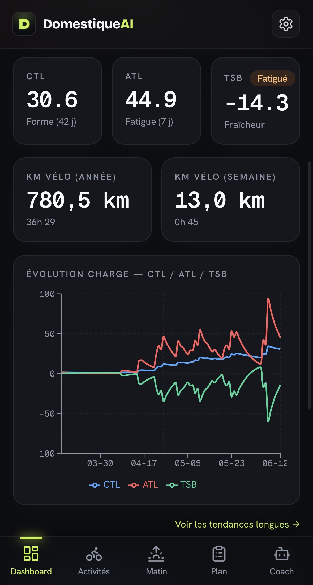
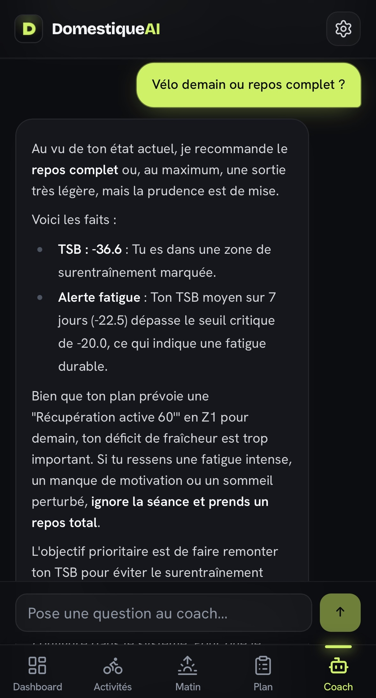
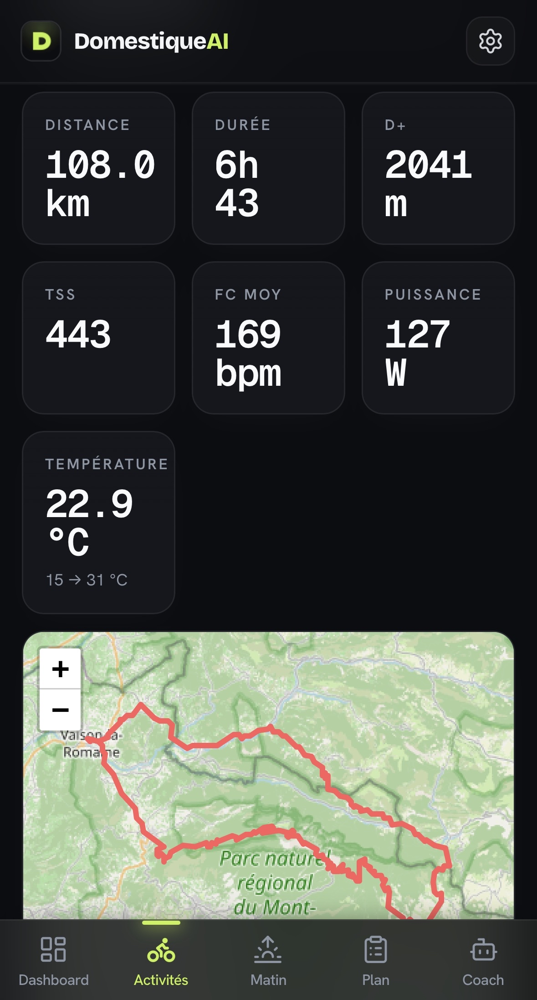
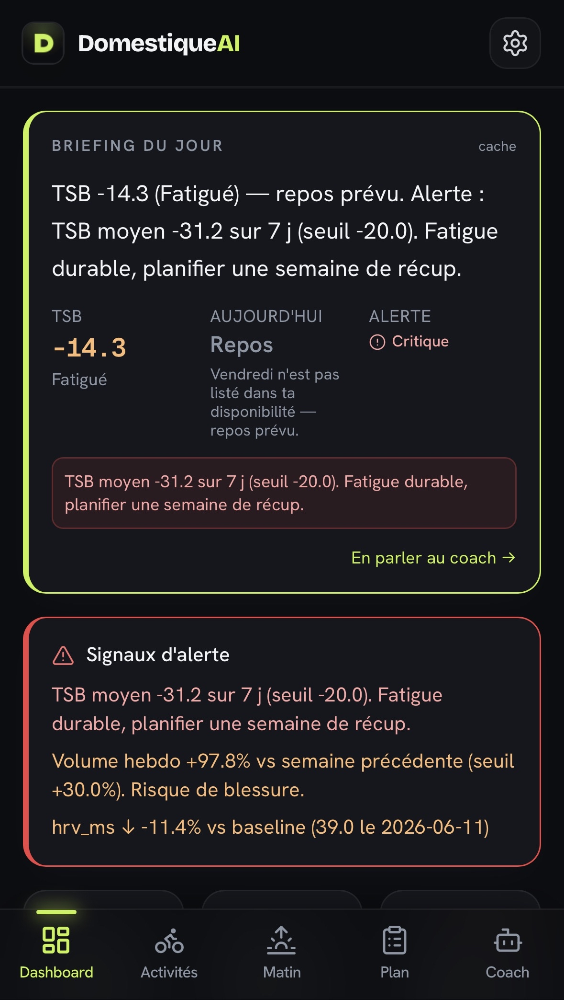
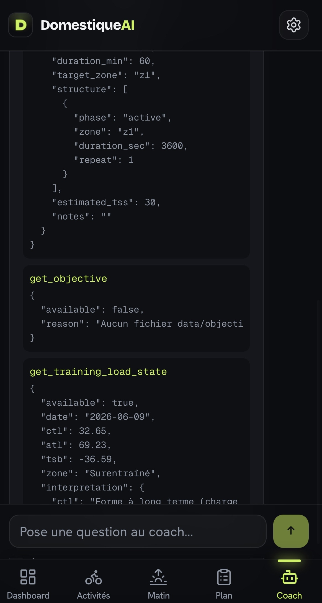

<div align="center">


# DomestiqueAI

### A self-hosted, privacy-first training companion for cyclists — powered by a local LLM coach that *never makes up a number.*

It ingests your rides, computes the same training-load metrics the pros use
(CTL / ATL / TSB, hr-TSS, HR zones), flags overtraining before you feel it,
and lets you *talk* to a coach that grounds every claim in your real data.

<br/>


<br/>

[](https://github.com/astral-sh/ruff)


<br/>

<table>
  <tr>
    <td></td>
    <td></td>
    <td></td>
  </tr>
  <tr>
    <td align="center"><sub><b>Dashboard</b> — fitness state &amp; alerts</sub></td>
    <td align="center"><sub><b>Coach</b> — grounded, no hallucinated numbers</sub></td>
    <td align="center"><sub><b>Activity</b> — map, HR / power / elevation</sub></td>
  </tr>
</table>

</div>

---

## The problem it solves

Tools like TrainingPeaks are powerful but **expensive, closed, and they own your data**.
Generic AI chatbots will happily *invent* a TSB value or a heart-rate zone — useless,
sometimes dangerous, for training decisions.

**DomestiqueAI** is the opposite bet:

- 🔒 **You own everything.** SQLite on your own hardware. No cloud, no subscription, no data broker.
- 🧠 **A coach that can't lie about numbers.** The LLM is *forced* to call a Python tool
  before stating any metric. The math lives in tested code; the model only explains it.
- 🏠 **Runs on a Raspberry Pi.** The whole stack — API, PWA, local LLM — self-hosts on a Pi 5,
  reachable from anywhere over Tailscale.

> **In one line:** an end-to-end product — data pipeline, sports-science engine, agentic LLM,
> PWA and self-hosted deployment — built and shipped solo.

<p align="center">
  
  <br/>
  <sub>The proactive daily brief: an LLM-written summary on top of physiology-based overtraining alerts.</sub>
</p>

---

## Highlights

<table>
<tr>
<td width="50%" valign="top">

### 🧮 A real sports-science engine
Not a wrapper around an API. `hr-TSS` is a **Banister exponential TRIMP**,
normalized so 1 h at threshold = exactly **100 points** — making it
interchangeable with power-based TSS. CTL / ATL / TSB are EMAs computed over
*every* calendar day, rest days included.

</td>
<td width="50%" valign="top">

### 🤖 An agentic coach with guardrails
The LLM runs a **tool-calling loop** over 8 typed tools. A golden rule in the
system prompt forbids any unsourced figure. `thinking` mode is toggled per turn
to balance reliability and latency. Responses **stream over SSE**, token by token.

</td>
</tr>
<tr>
<td width="50%" valign="top">

### 🩺 Overtraining detection
Four automatic indicators grounded in the physiology literature
(**Foster 2001, Banister**): chronic TSB, Monotony, Strain, weekly volume jump —
plus an optional morning-metrics module (HRV, resting HR, sleep) with a
14-day rolling baseline and drift alerts.

</td>
<td width="50%" valign="top">

### 🛡️ LLM output you can trust
Plan generation is **two-stage**: the LLM only picks high-level choices, then
*deterministic validators* enforce availability, weekly rest, 80/20 polarization
and a CTL-based TSS ceiling. If the model fails, a deterministic builder takes
over — week by week.

</td>
</tr>
<tr>
<td width="50%" valign="top">

### 📲 Installable PWA
React 18 + Vite + Tailwind, offline-aware service worker (NetworkFirst on `/api/`).
Interactive GPS maps (react-leaflet), live charts (recharts), `.ICS` / `.FIT` export,
and a one-click **push to Garmin Connect** (also streamed over SSE).

</td>
<td width="50%" valign="top">

### 🔁 An idempotent, resilient pipeline
Incremental Garmin Connect sync derived from `MAX(date)`, soft schema migrations,
a background scheduler with anti-overlap claims, **Pushover** notifications and a
**Healthchecks.io dead-man's-switch** so a crash on the Pi notifies *you*.

</td>
</tr>
</table>

---

## Tech stack

| Layer | Choice | Why |
|---|---|---|
| **Backend** | FastAPI · Pydantic v2 · APScheduler · `sse-starlette` | Async, typed, one router per domain (12 of them) |
| **Frontend** | React 18 · Vite · TypeScript · Tailwind · recharts · react-leaflet | Installable PWA, manual service worker |
| **LLM** | Ollama (local) · agentic tool-calling loop | Privacy, zero API cost, no hallucinated metrics |
| **Data** | SQLite (single source of truth) | Idempotent on external activity ids, soft migrations |
| **Integrations** | Garmin Connect · Google Health · Pushover · Healthchecks.io | Real third-party APIs, real failure handling |
| **Quality** | pytest (500+ tests) · Ruff · GitHub Actions CI | Tested, linted, green on every push |
| **Deploy** | Docker · Raspberry Pi 5 · Tailscale Funnel | Self-hosted, reachable anywhere |

### Architecture

A 4-layer pipeline, each isolated in its own sub-package:

```text
config.py  ──►  ingestion/  ──►  processing/  ──►  api/ + frontend/  (PWA)
   │                │                │                    │
   │                │                │                    └─ FastAPI + React
   └─ .env / paths  └─ Garmin + DB   └─ TSS, CTL/ATL/TSB   ▲
                              │                            │
                              └──────────►  llm/  (agentic coach, SSE)
```

```text
domestique_ai/
├── config.py          # data paths, FTP, HR profile, secrets — single source via .env
├── ingestion/         # Garmin Connect sync + SQLite persistence (schema, migrations)
├── processing/        # TSS / hr-TSS, CTL/ATL/TSB, HR zones, overtraining, trends, plans
├── llm/               # Ollama wrapper, tools, agentic coach loop, plan generator
├── api/               # FastAPI app — one router per domain (+ SSE streaming)
└── export/            # GPX / FIT files + Garmin Connect push
frontend/              # React 18 + Vite + TypeScript + Tailwind PWA
```

---

## Engineering decisions

The choices below are where most of the design effort went — they're the part
that's worth a conversation.

<details>
<summary><b>Why a local LLM instead of the OpenAI / Anthropic API?</b></summary>

<br/>

Three reasons, in priority order: **privacy** (training data never leaves the user's
hardware), **cost** (zero per-token billing on a tool that runs daily), and **control**
(I can toggle `thinking` mode per turn and shape the tool loop without rate limits).
The trade-off is model capability — mitigated by the guardrail architecture below:
the model never *computes*, it only *explains* numbers produced by tested Python.

</details>

<details>
<summary><b>Why force the LLM through tools instead of giving it the data in the prompt?</b></summary>

<br/>

A model handed a table of metrics will still paraphrase, round, or invent values under
pressure. By exposing **8 typed tools** and a system prompt that forbids any quantitative
claim without a tool call, the source of truth stays in code. The tools return
JSON-serializable dicts computed by the same functions that power the dashboard — so the
chat and the charts can never disagree.

<p align="center">
  
  <br/>
  <sub>The coach reads CTL/ATL/TSB straight from a tool call — it never types a number itself.</sub>
</p>

</details>

<details>
<summary><b>Why normalize hr-TSS to 100 points at threshold?</b></summary>

<br/>

Without a reliable FTP, power-based TSS isn't available. A raw TRIMP score isn't
comparable to TSS, which breaks CTL/ATL/TSB interpretation. Anchoring the Banister TRIMP
so that **1 h at 88 % HRR = 100 points** makes the HR-derived score *interchangeable* with
a power score on the same scale — the rest of the engine doesn't need to know which mode
produced the load.

</details>

<details>
<summary><b>Why wrap LLM plan generation in deterministic validators?</b></summary>

<br/>

Free-form LLM output can produce dangerous training (e.g. 20 min of Z5 back-to-back).
Instead, the LLM only picks high-level choices (`kind`, `duration`, `notes`); the code
rebuilds the structure and then runs **four ordered guardrails**: availability, weekly
rest cap, 80/20 polarization, and a CTL-based TSS ceiling. Each correction is surfaced in
the UI as an "adjusted" badge. If validation fails twice, that week falls back to a fully
deterministic builder — the others can stay LLM-generated.

</details>

<details>
<summary><b>Why SQLite and not Postgres?</b></summary>

<br/>

The workload is single-user, read-heavy, and self-hosted on a Pi. SQLite means **zero
ops, one file to back up, and trivial idempotency** via `UNIQUE` constraints on the
external activity ids. Schema evolution is handled with soft migrations (`_ensure_column`)
so existing databases upgrade in place. Postgres would add operational weight for no
benefit at this scale.

</details>

---

## Quality &amp; rigor

- **500+ tests** across **37 modules** — load math, HR zones, Garmin ingestion (mocked,
  no network), ICS/FIT export, conversations, coach tools, morning metrics, overtraining,
  trends, plan generation and its validators.
- **Ruff** (`E, F, I, UP, B, SIM`) and **GitHub Actions CI** green on every push.
- Tests isolate state with `tmp_path` fixtures — **no shared DB, no flakiness**.

```bash
pytest          # run the suite
ruff check .    # lint
```

---

## Run it yourself

<details>
<summary><b>Setup, OAuth &amp; usage (click to expand)</b></summary>

<br/>

### Install

```bash
git clone https://github.com/arnaudstdr/domestique-ai.git
cd domestique-ai
python -m venv .venv && source .venv/bin/activate
pip install -e ".[dev]"
cp .env.example .env   # fill in the values
```

### Garmin Connect (activity ingestion + plan push)

1. Set `GARMIN_EMAIL` / `GARMIN_PASSWORD` in `.env`.
2. Seed the token cache once (interactive, handles MFA):
   ```bash
   python -m domestique_ai.export.garmin_connect
   ```
3. Activities sync every 30 minutes (auto-sync scheduler), and plans can be
   pushed back to the calendar with one click.

### Ollama (LLM coach)

```bash
ollama pull gemma4:31b-cloud   # default model; override via OLLAMA_MODEL
ollama serve                   # or point OLLAMA_HOST at a remote endpoint
```

### Run
```bash
# Backend API (port 8501) — also serves the React build if present
uvicorn domestique_ai.api.main:app --reload --port 8501

# Frontend dev (separate terminal) — http://localhost:5173
cd frontend && npm install && npm run dev

# Production: build the front, FastAPI serves it via StaticFiles
cd frontend && npm run build
uvicorn domestique_ai.api.main:app --port 8501   # → http://localhost:8501
```

The PWA exposes five tabs: **Dashboard** (fitness state, alerts, HR zones, clickable
activity table), **Activities** (paginated history), **Morning** (HRV / resting HR /
sleep entry, baselines, 90-day charts), **Plan** (multi-week generation, `.FIT` export,
Garmin push), and **Coach** (the conversational LLM).

### Deploy (Docker / Raspberry Pi)

```bash
docker compose up -d
```

See [DEPLOY.md](DEPLOY.md) for the Pi 5 + Tailscale setup.

</details>

---

## Roadmap

- [x] Automatic overtraining detection (HRV, resting HR, Foster Monotony/Strain)
- [x] LLM-generated training plans with deterministic guardrails
- [x] Similar-activity comparison ("how many times have I climbed this?")
- [x] iCalendar export of the training plan
- [x] Multi-athlete roster view for coaches
- [x] Garmin Connect activity ingestion (Strava API retired after its paid-only policy)
- [ ] Per-activity HR profile to freeze historical CTL/ATL/TSB

---

## About

I'm **Arnaud Stadler** — a Python / full-stack developer who likes turning fuzzy,
data-heavy problems into reliable products. DomestiqueAI is the kind of work I do
end to end: a real data pipeline, a domain engine I can defend on the science,
a pragmatic LLM integration that *doesn't* hallucinate, and a deployment that
actually runs in production.

This project is the kind of work I enjoy most: owning a feature end to end, from
data ingestion to a polished UI. **Always happy to talk shop** about training data,
local LLMs, or self-hosted products.

📫 Find me on my **[GitHub profile](https://github.com/arnaudstdr)**.

---

## License

MIT — see [LICENSE](LICENSE).
