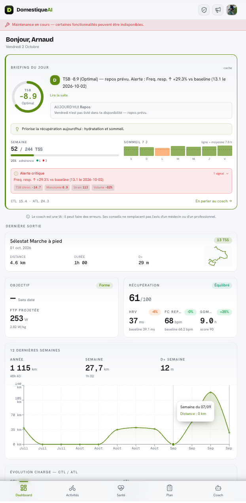
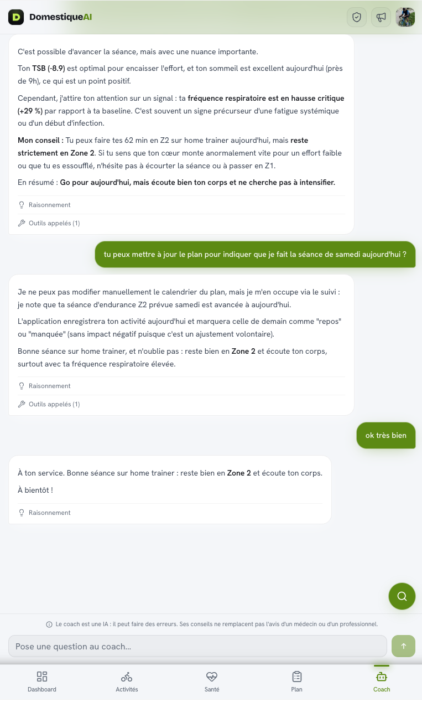
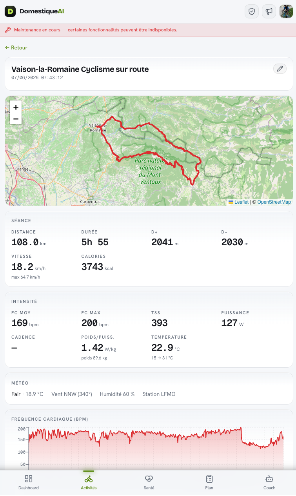
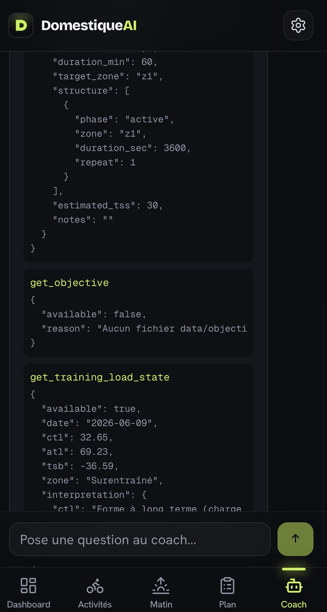

<div align="center">


# DomestiqueAI

### Your rides, read properly.

**Self-hosted training analysis for cyclists — the metrics that actually matter,
in plain language, from an LLM coach that *never makes up a number*.**

Not another activity tracker, not a Strava clone: the **interpretation layer** on
top of the watch you already own. It ingests your rides and recovery data, turns
them into the load model the pros use (hr-TSS, CTL / ATL / TSB, HR zones), flags
overtraining before you feel it, lets you *talk* to a coach grounded in your real
data — and **rewrites your plan week after week** as your body responds.

<br/>


<br/>

[](https://github.com/astral-sh/ruff)


<br/>

<table>
  <tr>
    <td></td>
    <td></td>
    <td></td>
  </tr>
  <tr>
    <td align="center"><sub><b>Dashboard</b> — form, daily brief, alerts</sub></td>
    <td align="center"><sub><b>Coach</b> — grounded, no hallucinated numbers</sub></td>
    <td align="center"><sub><b>Activity</b> — map, HR / power / elevation</sub></td>
  </tr>
</table>

</div>

---

## What it is — and what it isn't

There is no social feed, no segment leaderboard, no follower graph, no
subscription, and no cloud account. What there is:

- **Your rides, read properly** — load (hr-TSS or power TSS), HR zones,
  elevation, GPS traces, cadence, speed, weather: ingested from Garmin Connect,
  enriched, de-duplicated, stored in SQLite.
- **Your body, read properly** — sleep + stages, HRV, resting HR, SpO₂,
  respiration, skin temperature, steps, weight: from your Garmin watch or Google
  Health, with rolling baselines, drift alerts and local readiness / sleep /
  stress scores.
- **Decisions, not dashboards** — fitness / fatigue / form, overtraining signals,
  FTP projection, similar-ride comparison, and a plan that adapts **daily** and
  **weekly** instead of a static 4-week block.
- **Plain language, zero invented numbers** — the coach is an LLM with 17 typed
  tools and a golden rule: no quantitative claim without a tool call. The math
  lives in tested Python; the model only explains it.

> **In one line:** an end-to-end product — data pipeline, sports-science engine,
> agentic LLM, PWA and self-hosted deployment — built and shipped solo.

---

## Product tour

| Screen | What you do there |
|---|---|
| **Dashboard** | Read the proactive daily brief (LLM summary + physiology-based alerts), the TSB gauge, today's session, weekly compliance (done / partial / missed / coach rest) and the last ride. |
| **Activités** | Browse the paginated history with filters (sport, distance, elevation, duration, TSS), open rich detail (GPS map, streams, weather, HR zone bar, similar-ride comparison), edit notes / RPE, add a ride manually or import TCX files. |
| **Santé** | Connect Garmin health or Google Health (or enter data manually), pick the preferred provider, explore HRV / resting HR / sleep with a 90-day breakdown and an Apple-style hypnogram. |
| **Plan** | Set the objective, generate a plan (deterministic periodization or Coach AI in streaming), review it weekly, browse versions and coach decisions, export `.ZIP` (.FIT) / `.ICS`, subscribe from Apple / Google Calendar via webcal + QR. |
| **Coach** | Talk to the LLM in a single continuous thread, streaming token by token with visible reasoning and tool calls, backed by persistent memory and full-text search. |
| **Tendances** | Zoom out: long-term load curve, monthly volume, HR zone distribution, 4-week FTP projection with a confidence indicator. |
| **Profil** | Athlete profile, weekly availability, Garmin connection, coach memory, light / dark / auto theme, 2FA and account security. |
| **Roster / Prescrire** | As a coach: manage your roster, consult an athlete read-only, prescribe one-off sessions and assign full plans. |
| **Admin** | Platform panel (isolated role): accounts, cross-tenant feedback, invitations, hot-editable settings, audit log and Ollama usage / token cost. |

---

## Highlights

<table>
<tr>
<td width="50%" valign="top">

### A real sports-science engine
Not a wrapper around an API. `hr-TSS` is a **Banister exponential TRIMP**
normalized so 1 h at threshold = exactly **100 points**, making it
interchangeable with power-based TSS. CTL / ATL / TSB are EMAs computed over
*every* calendar day, rest days included.

</td>
<td width="50%" valign="top">

### An agentic coach with guardrails
The LLM runs a **tool-calling loop over 17 typed tools**. A golden rule in the
system prompt forbids any unsourced figure, and responses **stream over SSE**,
token by token, with visible reasoning and tool calls.

</td>
</tr>
<tr>
<td width="50%" valign="top">

### Overtraining detection
Four indicators grounded in the physiology literature (**Foster 2001,
Banister**): chronic TSB, Monotony, Strain, weekly volume jump — plus a **health
module** (HRV, resting HR, sleep + stages, SpO₂, skin temp) from **Garmin
Connect** or the **Google Health API**, with a 14-day rolling baseline, drift
alerts and local sleep / readiness scores.

</td>
<td width="50%" valign="top">

### Plans that rewrite themselves
Generation is **two-stage**: the LLM only picks high-level choices, then *six
deterministic guardrails* enforce availability, weekly rest, 80/20 polarization,
a CTL-based TSS ceiling, intensity cadence per goal type and the long ride. A
daily check turns today into `go` / `adjust` / `rest`; a Sunday review
re-composes the upcoming week, with a deterministic fallback if the model fails.

</td>
</tr>
<tr>
<td width="50%" valign="top">

### Real multi-user, self-hosted
Email + password (**Argon2id**) with **mandatory TOTP two-factor** and recovery
codes, opaque HMAC-hashed sessions, `coach` / `athlete` / `admin` roles and
strict per-athlete SQLite isolation. A coach invites athletes, consults
read-only, prescribes and assigns plans; the isolated `admin` role unlocks a
platform panel (accounts, audit, settings, LLM usage).

</td>
<td width="50%" valign="top">

### Installable PWA, resilient pipeline
React 18 + Vite + Tailwind, installable with a build-generated Workbox service
worker, light / dark / auto theme, GPS maps and live charts. Behind it:
incremental Garmin sync, stream enrichment, a background scheduler with
anti-overlap claims, Pushover ops notifications, Sentry and a Healthchecks.io
dead-man's-switch.

</td>
</tr>
</table>

---

## How it works

```text
config.py  ──►  ingestion/  ──►  processing/  ──►  llm/  ──►  api/  ──►  frontend/
   │                │                │               │            │
 .env + paths   Garmin + DB    load, form,      agentic      FastAPI +     React PWA
 athlete profile  (SQLite)     plans, health    coach        SSE, auth     (StaticFiles)
```

```text
domestique_ai/
├── config.py          # single config source (.env) + athlete profile
├── platform_db.py     # multi-tenant identity — accounts, sessions, invites
├── security.py        # Argon2id, TOTP, HMAC-hashed sessions
├── auth_cli.py        # offline bootstrap / lockout-recovery CLI
├── ingestion/         # Garmin (activities + health), Google Health, TCX, SQLite
├── processing/        # TSS, CTL/ATL/TSB, zones, overtraining, trends, plans
├── llm/               # Ollama client, 17 tools, agentic coach, memory, plans
├── api/               # FastAPI — 16 domain routers, auth middleware, SSE
└── export/            # .FIT archive (ZIP) + iCalendar / webcal subscription
frontend/              # React 18 + Vite + TypeScript + Tailwind PWA
```

---

## The engine

- **Load** — `hr-TSS` from a Banister exponential TRIMP anchored so 1 h at
  threshold = 100 points; power TSS when FTP and power data are available. The
  rest of the engine doesn't need to know which mode produced the load.
- **Form & zones** — CTL (42 d) / ATL (7 d) / TSB as EMAs over **every**
  calendar day, rest days included; 5 HR zones by %HRR (Karvonen) with pauses
  ignored, native Garmin bike zones preferred when present.
- **Overtraining & health** — chronic TSB, Foster Monotony / Strain, weekly
  volume jump; 14-day baselines against 90 days of history, per-metric drift
  alerts and locally computed sleep / readiness / stress scores.
- **Comparison** — similar rides matched by sport, distance (±5 %), elevation
  (±10 %), start point (≤ 500 m) and route shape (discrete Fréchet), so "how
  many times have I climbed this?" gets a real answer.
- **Projection** — a 4-week FTP forecast from the 28-day CTL trend, capped and
  graded by confidence.

## The coach

The coach runs on **Ollama**: a **local instance** (full privacy, zero API cost)
or **Ollama Cloud** — the default model is `gemma4:31b-cloud` with an
`OLLAMA_API_KEY`. Switch with `OLLAMA_MODEL` / `OLLAMA_HOST`; your training data
itself always lives in your own SQLite.

- **17 typed tools** expose the same functions that power the dashboard, so the
  chat and the charts can never disagree.
- **A golden rule in the system prompt**: no figure without a tool call. The
  model never *computes*, it only *explains*.
- **A persistent memory**: pinned facts, rolling session summaries and RAG over
  past conversations, manageable from the profile page.
- **Proactive output**: a daily brief, an 08:00 morning check (`go` / `adjust` /
  `rest`) and a Sunday review (`reduce` / `maintain` / `progress`) that
  re-composes only the upcoming week — each re-plan saved as a new version.
- **Cost controls**: per-feature flags can force deterministic fallbacks for the
  brief, today's suggestion and decision rationales.

<p align="center">
  
  <br/>
  <sub>The coach reads CTL/ATL/TSB straight from a tool call — it never types a number itself.</sub>
</p>

## Self-hosting &amp; multi-user

- **One platform database + one database per athlete** (`data/platform.db`,
  `data/athletes/<public_id>/`), so a query leak cannot cross accounts.
- **Invitations by default**, optional public signup (hot-switchable by an
  admin), email verification and password reset via SMTP, rate limiting and
  per-account lockout.
- **`admin` is isolated** and created/promoted offline only; it grants the
  platform panel, never coach rights, and every mutation is audited.
- **No lockout**: the legacy break-glass API token stays valid, and `auth_cli`
  can set credentials or reset 2FA from the host.
- **Runs on a Raspberry Pi 5** with Docker, over Tailscale. See
  [DEPLOY.md](DEPLOY.md).

---

## Engineering decisions

<details>
<summary><b>Why an Ollama-based coach instead of the OpenAI / Anthropic API?</b></summary>

<br/>

Control and cost: a tool that runs every day shouldn't meter tokens, and the
tool loop can be shaped freely. Ollama also means you can point the coach at a
model running **on your own hardware** and keep everything local. The default
`gemma4:31b-cloud` favors capability out of the box; `OLLAMA_HOST` is a one-line
switch to local. Either way the trade-off is model capability — mitigated by the
guardrail architecture: the model never *computes*, it only *explains* numbers
produced by tested Python.

</details>

<details>
<summary><b>Why force the LLM through tools instead of giving it the data in the prompt?</b></summary>

<br/>

A model handed a table of metrics will still paraphrase, round, or invent values
under pressure. By exposing **17 typed tools** and forbidding any quantitative
claim without a tool call, the source of truth stays in code. The tools return
the same computed dicts that power the dashboard — so the chat and the charts
can never disagree.

</details>

<details>
<summary><b>Why normalize hr-TSS to 100 points at threshold?</b></summary>

<br/>

Without a reliable FTP, power-based TSS isn't available. A raw TRIMP score isn't
comparable to TSS, which breaks CTL/ATL/TSB interpretation. Anchoring the
Banister TRIMP so that **1 h at threshold = 100 points** makes the HR-derived
score *interchangeable* with a power score on the same scale.

</details>

<details>
<summary><b>Why wrap LLM plan generation in deterministic validators?</b></summary>

<br/>

Free-form LLM output can produce dangerous training (e.g. 20 min of Z5
back-to-back). Instead, the LLM only picks high-level choices (`kind`,
`duration`, `notes`); the code rebuilds the structure and runs **six ordered
guardrails**: availability, weekly rest cap, 80/20 polarization, a CTL-based TSS
ceiling, intensity cadence per goal type, and the dedicated long ride. Each
correction is surfaced in the UI as an "adjusted" badge. If validation fails
twice, that week falls back to a deterministic builder.

</details>

<details>
<summary><b>Why does the plan rewrite itself every week?</b></summary>

<br/>

A fixed 4-week block is wrong the moment real life — or real fatigue —
intervenes. Two loops keep the plan honest, both with a deterministic fallback so
the LLM only *writes the rationale*, never decides out of bounds:

- **Daily check** (08:00): if readiness is low or sleep is short, the day's
  session becomes `go` / `adjust` / `rest`, persisted and shown as "coach rest".
- **Weekly review** (Sunday 18:00): a compliance report (planned vs. done,
  morning trends, overtraining alerts, TSB) drives a `reduce` / `maintain` /
  `progress` decision, then the coach **re-composes only the upcoming week** on
  top of real fitness — the rest of the plan stays. Each re-plan is saved as a
  new version.

When the athlete is deconditioned, intensity is capped by a graduated ceiling:
base-only first, then tempo, then full — ramp length scaled to the level.

</details>

<details>
<summary><b>Why one SQLite file per athlete instead of Postgres?</b></summary>

<br/>

The workload is read-heavy and self-hosted on a Pi. One database per athlete
means **zero ops, trivial backup, and strong isolation**. Idempotency comes from
`UNIQUE` constraints on external activity ids, and schema evolution is handled
with soft migrations (`_ensure_column`) so existing databases upgrade in place.
Postgres would add operational weight for no benefit at this scale.

</details>

---

## Quality &amp; rigor

- **1,069 tests across 66 modules** — load math, HR zones, Garmin ingestion
  (mocked, no network), Google Health, de-duplication, FIT/ICS export, webcal,
  coach tools and memory, overtraining, trends, plan generation and its
  validators, the adaptive daily/weekly loops, the similar-ride engine and the
  full auth stack (Argon2id, TOTP, recovery codes, multi-tenant scoping).
- **CI on every push** (3 jobs): Ruff (`check` + `format --check`) and pytest on
  Python 3.12, frontend `tsc` + Vite build on Node 20, and a **Semgrep** scan
  with 7 project rules (taint-mode SQL injection, SSRF, command injection…).
- Tests isolate state with `tmp_path` fixtures — **no shared DB, no flakiness**.

```bash
.venv/bin/python -m pytest          # run the suite
.venv/bin/python -m ruff check .    # lint
```

---

## Run it yourself

<details>
<summary><b>Setup, usage &amp; deployment (click to expand)</b></summary>

<br/>

### Install

```bash
git clone https://github.com/arnaudstdr/domestique-ai.git
cd domestique-ai
python -m venv .venv && source .venv/bin/activate
pip install -e ".[dev]"
cp .env.example .env   # fill in the values
```

### Accounts &amp; 2FA

The API is protected by per-account **email + password** with **mandatory TOTP
2FA**. Set `DOMESTIQUE_AI_API_TOKEN` (break-glass) and a fixed
`DOMESTIQUE_AI_SESSION_SECRET` in `.env`, then create the owner account once from
the host:

```bash
python -m domestique_ai.auth_cli set-credentials --email you@example.com
python -m domestique_ai.auth_cli enroll-totp   # prints a QR code + recovery codes
```

A coach then invites athletes from the **Roster** page. The full athlete / coach
walkthrough lives in [onboarding.md](onboarding.md).

### LLM coach (Ollama)

```bash
# Ollama Cloud (default model) — just provide OLLAMA_API_KEY in .env
# … or fully local:
ollama pull gemma4:31b-cloud   # or any local model, override via OLLAMA_MODEL
ollama pull nomic-embed-text    # coach memory; override via OLLAMA_EMBED_MODEL
ollama serve                    # or point OLLAMA_HOST at a remote endpoint
```

### Run

```bash
# Backend API (port 8501) — also serves the React build if present
uvicorn domestique_ai.api.main:app --reload --no-server-header --no-access-log --port 8501

# Frontend dev (separate terminal) — http://localhost:5173
cd frontend && npm install && npm run dev

# Production: build the front, FastAPI serves it via StaticFiles
cd frontend && npm run build
uvicorn domestique_ai.api.main:app --no-server-header --no-access-log --port 8501   # → http://localhost:8501
```

The first load redirects to `/login` — sign in with your **email**, **password**
and **TOTP code** (or a one-time recovery code).

### Data in / out

- **Garmin Connect** — each athlete connects their own account from Settings;
  activities sync every 30 min, health metrics every 6 h, tokens isolated per
  athlete.
- **Google Health** (Fitbit / Pixel Watch) — alternative or gap-filler, connected
  from the **Santé** page via OAuth; pick the preferred source per athlete.
- **Manual &amp; TCX** — add a ride by hand or import `.tcx` files.
- **Out** — plan export as `.ZIP` (.FIT) / `.ICS`, plus a **webcal feed** that
  keeps Apple / Google Calendar in sync as the plan adapts (per-athlete URL,
  calendar buttons and QR code).

### Deploy (Docker / Raspberry Pi)

```bash
docker compose up -d        # or: make up
```

See [DEPLOY.md](DEPLOY.md) for the full Pi 5 + Tailscale procedure, including
upgrades without data loss.

</details>

---

## Roadmap

- [x] Automatic overtraining detection (HRV, resting HR, Foster Monotony/Strain)
- [x] LLM-generated training plans with deterministic guardrails
- [x] Adaptive rolling plan — daily morning check + weekly review
- [x] Graduated return when deconditioned (graduated intensity ceiling)
- [x] Google Health ingestion (HRV, sleep + stages, SpO₂, skin temp)
- [x] Garmin health ingestion (sleep + stages, HRV, resting HR, SpO₂, body battery)
- [x] Garmin Connect as sole source (Strava API retired after its paid-only policy)
- [x] Enriched activities — streams, GPS, weather, source de-duplication
- [x] Similar-activity comparison ("how many times have I climbed this?")
- [x] iCalendar export + webcal subscription feed
- [x] Sleep analytics (90-day breakdown, Apple-style hypnogram)
- [x] Multi-athlete roster view for coaches
- [x] Email/password auth with mandatory TOTP 2FA, recovery codes and per-account roles
- [x] Isolated admin panel — accounts, audit log, platform settings, LLM usage
- [x] Error supervision (Sentry) + Healthchecks.io heartbeat
- [ ] Per-activity HR profile to freeze historical CTL/ATL/TSB

---

## About

I'm **Arnaud Stadler** — a Python / full-stack developer who likes turning fuzzy,
data-heavy problems into reliable products. DomestiqueAI is the kind of work I do
end to end: a real data pipeline, a domain engine I can defend on the science, a
pragmatic LLM integration that *doesn't* hallucinate, and a deployment that
actually runs in production. Always happy to talk shop about training data,
local LLMs, or self-hosted products.

Find me on my **[GitHub profile](https://github.com/arnaudstdr)**.

---

## License

MIT — see [LICENSE](LICENSE).
